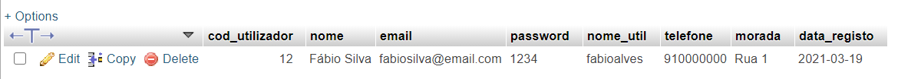

# PHP User Management

PHP simple project of user management using mySQL database: 

- Create User
- User List
- Delete User
- Logout

PHP MyAdmin was used as DATABASE. To configure your database you need to change the DB settings on the *config.php* file. For this project the DB has one table named *produtos* as you can see on the following image.

**Users Table**

For the first login you need to create an user manually on the DB.

>The project has comments lines in Portuguese and some variables are written in Portuguese as well.

